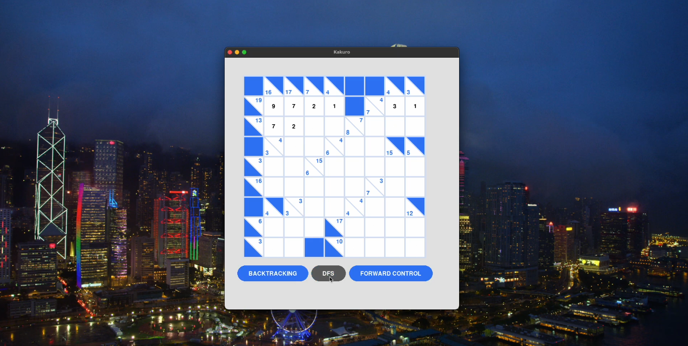
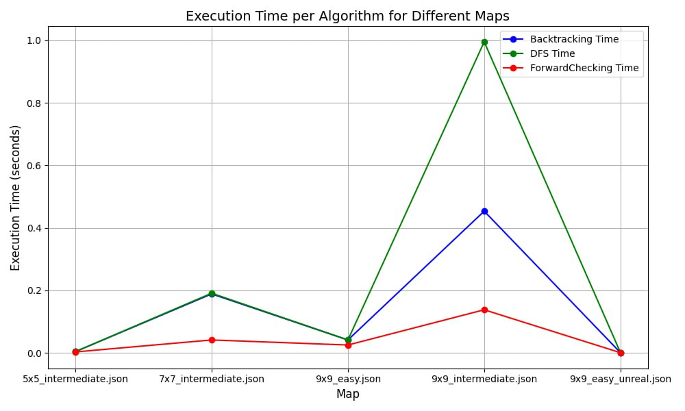
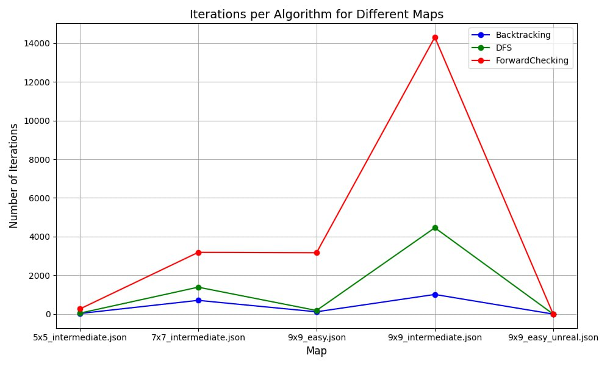

# Kakuro Solver

Kakuro is a number puzzle similar to crosswords but involves numerical constraints. This project implements an AI-based Kakuro solver using **Depth-First Search (DFS)**, **Backtracking**, and **Forward Checking** to efficiently solve Kakuro puzzles of varying difficulty.



[YouTube Link with recorded solving](https://www.youtube.com/watch?v=J5iDVmoueNc&ab_channel=Dillir)

## ✨ Features

- Loads Kakuro puzzles from JSON files.
- Uses different AI algorithms to solve puzzles efficiently.
- Comes with five sample puzzles, including one that has no solution.
- Measures algorithm performance through statistical analysis.

## 🧩 Problem Description

Kakuro is a number puzzle played on a grid where:

- Each blank cell needs a number between **1 and 9**.
- The sum of numbers in each row and column must match the target given in adjacent cells.
- A number cannot repeat within the same sum group.

## 🤖 Algorithms Implemented

### 1. Depth-First Search (DFS) 🔍

DFS systematically explores possible number placements by diving deep into each configuration:

- Recursively assigns values until a valid solution is found or all options are exhausted.
- If constraints are violated, it backtracks and tries a new path.

**Limitations:**

- Can be slow for large or complex puzzles.
- Without proper cycle handling, it may explore redundant paths.

### 2. Backtracking 🔄

Backtracking tries to assign numbers step by step, reverting when necessary:

- Ensures only valid assignments are made at each stage.
- If an assignment leads to a conflict, it backtracks and attempts another number.

**Advantages:**

- Always finds a solution if one exists.

### 3. Forward Checking 🚀

Forward Checking enhances Backtracking by eliminating invalid choices early:

- Updates possible values for unassigned cells after each placement.
- If a cell runs out of valid numbers, it backtracks immediately.

**Advantages:**

- Shrinks the search space, making solving faster.

## 📥 Input Format

Puzzles are provided in **JSON format**, structured as follows:

```json
{
  "size": 5,
  "puzzle": [
    ["*", "*", 16, "*", 17],
    ["*", 3, "_", "_", "_"],
    [10, "_", "_", "_", "*"],
    ["*", "_", "_", "_", 6],
    [12, "_", "_", "_", "*"]
  ]
}
```

- `*` represents black cells (non-playable spaces).
- Numbers indicate the target sum for that row or column.
- `_` represents blank cells that need to be filled with digits.

## 📊 Evaluation Metrics





Results clearly show that even though Forward checking has at most number of iterations, it solves Kakuro in the fastest way.

## 💡 Conclusions 

- For simple and moderately complex puzzles, backtracking can be sufficient.
- For difficult puzzles or when high efficiency is needed, Forward Checking is the
best choice.
- DFS can be useful for understanding the basic structure of a problem, but is not ideal
for practical solving complex puzzles.
- Based on testing results, a combination of algorithms can be recommended, with Forward
Checking serving as the main method and Backtracking serving as a complementary method, ensuring both reliability
and efficiency.

